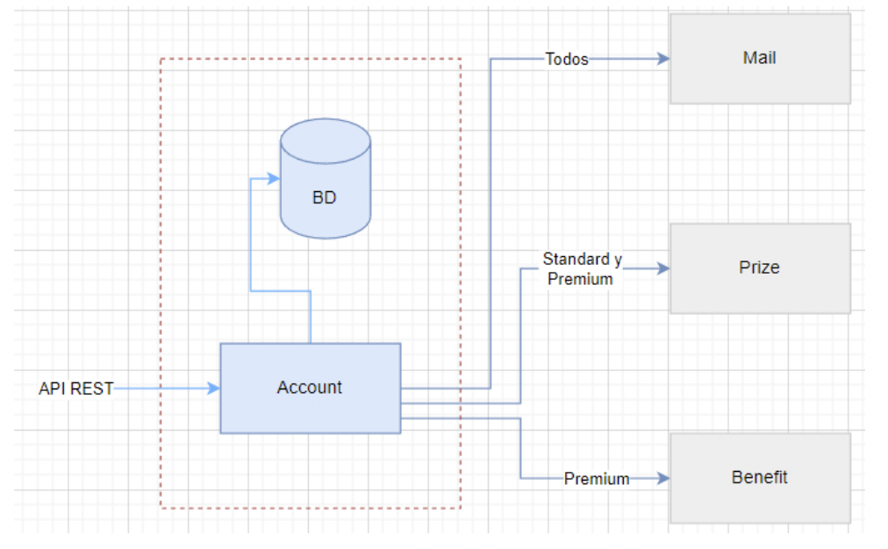

# Prueba técnica
## Parte teórica
1. ¿Cómo evitar el problema N+1 en los ORM?
   - Podemos hacer uso de la anotación @Query(...) para optimizar a un solo
    query, adicionalmente podemos utilizar JPQL o NativeQuery.
   <br>Referencias: 
     - https://www.baeldung.com/spring-data-jpa-query#select-query
     - https://docs.spring.io/spring-data/jpa/docs/current-SNAPSHOT/reference/html/#jpa.query-methods.at-query
   - Otra opción es utilizar la anotación @EntityGraph y mapear los valores
    de la relación. <br>Referencias:
     - https://www.baeldung.com/spring-data-jpa-named-entity-graphs
     - https://docs.spring.io/spring-data/jpa/docs/current/api/org/springframework/data/jpa/repository/EntityGraph.html
2. ¿De qué manera podemos lograr una transacción distribuida en microservicios?
   - Se realizaria mediante patrón 2PC, donde verificariamos la consistencia de
   los datos, en caso ocurra un error en algún paso, se realizaria rollback
   a todo el proceso. <br>Referencia: https://www.geeksforgeeks.org/two-phase-commit-protocol-distributed-transaction-management/
   - Otra opción es la de utilizar patrón SEGA y avanzar con respecto a la 
   orquestación de eventos que se vayan ejecutando. <br>Referencia: https://microservices.io/patterns/data/saga.html
3. ¿Qué verbos HTTP son idempotentes?
   - GET
   - PUT
   - DELETE
4. ¿Diferencia entre aplicaciones Stateless y Stateful?
   - Las aplicaciones Stateless son servicios que no almacenan estados o
   transacciones, por lo general tienen alguna función especifica. Suelen
   ser microservicios con utilidad especifica. Ejm: MS-ACCOUNT, que muestra 
   información de una cuenta.
   - Las aplicaciones Stateful por el contrario si cuentan con persistencia de 
   información y pueden ser instancias de bases de datos.
5. ¿En qué casos usaría una cola de mensajería?
   - Carga de lotes masivos
   - Tratamiento de archivos asincronos
   

## Parte práctica
Se requiere implementar una API REST para administrar un servicio de streaming por
suscripción, a través del API debemos poder realizar un CRUD de Cuentas.

Existen 3 tipos de cuenta: BASIC(1), STANDARD(2), PREMIUM(3).

Al momento de crear una cuenta:
- A TODAS las cuentas se les envía un MAIL de bienvenida.
- Las cuentas de tipo STANDARD y PREMIUM deben ser enviadas al microservicio
PRIZE.
- Solo las cuentas de tipo PREMIUM deben ser enviadas al microservicio BENEFIT.
CONSIDERACIONES:
- Para la dependencia de componentes externos ya sea el MAIL, o los microservicios
PRIZE y BENEFIT usar Stubs.
- Considere usar una base de datos embebida, por ejemplo: H2 o HSQLDB.
- Para la creación de una cuenta considerar el siguiente JSON como ejemplo:
    ```json
    {
        "username": "username",
        "password": "password",
        "email": "email@email.com",
        "phoneNumber" : 9999999999,
        "accountType": 1
    }
    ```
  
#### RECOMENDACIONES
Tener en cuenta buenas prácticas, código limpio, patrones de diseño según considere
necesario.
